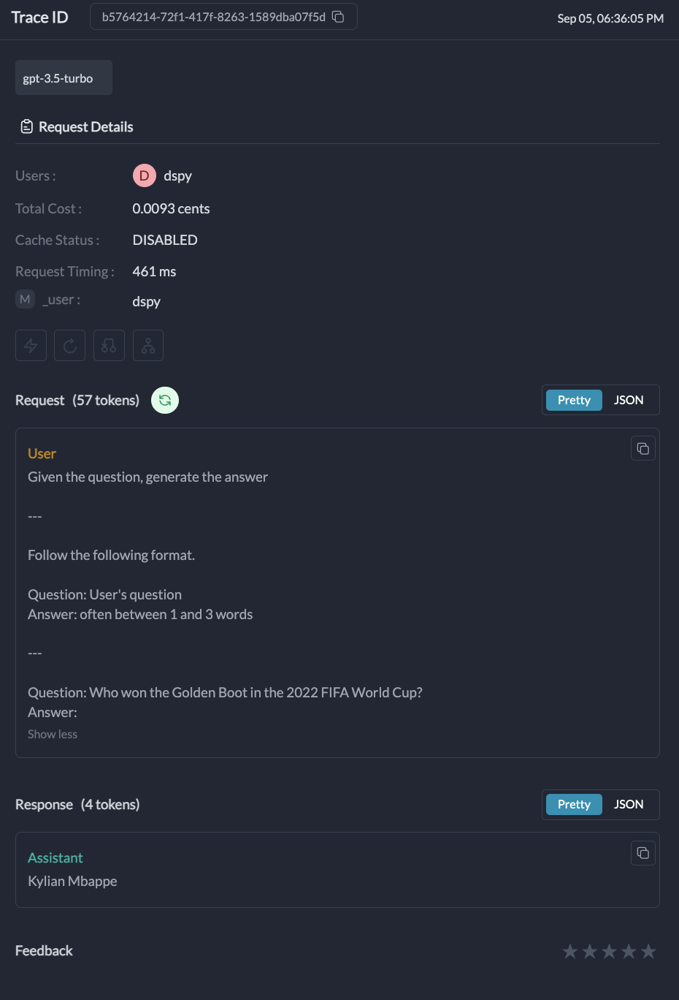

# DSPy

DSPy is a framework for algorithmically optimizing language model prompts and weights.&#x20;

Portkey's integration with DSPy makes your DSPy pipelines production-ready with detailed insights on costs & performance metrics for each run, and also makes your existing DSPy code work across 250+ LLMs.

## Getting Started

### **Installation**

```bash
!pip install dspy-ai==2.4.14  # Use Version 2.4.14 or higher
!pip install portkey-ai
```

### **Setting up**

Portkey extends the existing `OpenAI` client in DSPy and makes it work with 250+ LLMs and gives you detailed cost insights. Just change `api_base` and add Portkey related headers in the `default_headers` param.&#x20;


Grab your Portkey API key from [here](https://app.portkey.ai/).


<pre class="language-python"><code class="lang-python">import os
from portkey_ai import PORTKEY_GATEWAY_URL, createHeaders
import dspy

# Set up your Portkey client
turbo = dspy.OpenAI(
<strong>    api_base=PORTKEY_GATEWAY_URL + "/",
</strong>    model='gpt-4o',
    max_tokens=250,
    api_key="YOUR_OPENAI_API_KEY", # Enter Your OpenAI key
    model_type="chat",
<strong>    default_headers=createHeaders(
</strong><strong>        api_key="YOUR_PORTKEY_API_KEY", # Enter Your Portkey API Key
</strong><strong>        metadata={'_user': "dspy"},
</strong><strong>        provider="openai"
</strong><strong>    )
</strong>)

# Configure DSPy to use the Portkey-enabled client
dspy.settings.configure(lm=turbo)
</code></pre>

:tada: Voila! that's all you need to do integrate Portkey with DSPy. Let's try making our first request.

## Let's make your first Request

Here's a simple Google Colab notebook that demonstrates DSPy with Portkey integration

[](https://colab.research.google.com/drive/1IDdBoU9S\_LAdueZkIcSx5F14wvjhKU3C?usp=sharing)

```python
import dspy

# Set up the Portkey-enabled client (as shown in the Getting Started section)

class QA(dspy.Signature):
    """Given the question, generate the answer"""
    question = dspy.InputField(desc="User's question")
    answer = dspy.OutputField(desc="often between 1 and 3 words")

dspy.settings.configure(lm=turbo)

predict = dspy.Predict(QA)

# Make a prediction
prediction = predict(question="Who won the Golden Boot in the 2022 FIFA World Cup?")
print(prediction.answer)
```

When you make a request using Portkey with DSPy, you can view detailed information about the request in the Portkey dashboard. Here's what you'll see:

<div align="left">

<figure><figcaption></figcaption></figure>

</div>

* `Request Details`: Information about the specific request, including the model used, input, and output.
* `Metrics`: Performance metrics such as latency, token usage, and cost.
* `Logs`: Detailed logs of the request, including any errors or warnings.
* `Traces`: A visual representation of the request flow, especially useful for complex DSPy modules.

***

### Portkey Features with DSPy

### 1. [Interoperability](../../product/ai-gateway/universal-api.md)

Portkey's Unified API enables you to easily switch between **250**+ language models. This includes the LLMs that are not natively integrated with DSPy. Here's how you can modify your DSPy setup to use Claude from Gpt-4  model:



Here's how you'd use OpenAI with Portkey's DSPy integration:

<pre class="language-python"><code class="lang-python">turbo = dspy.OpenAI(
    api_base=PORTKEY_GATEWAY_URL + "/",
<strong>    model='gpt-4o',
</strong><strong>    api_key="YOUR_OPENAI_API_KEY", # Enter your Anthropic API key
</strong>    model_type="chat",
    default_headers=createHeaders(
        api_key="YOUR_PORTKEY_API_KEY",
        metadata={'_user': "dspy"},
<strong>        provider="openai"
</strong>    )
)
dspy.settings.configure(lm=turbo)
</code></pre>

Now, to switch to Anthropic, just change your provider slug to `anthropic` and enter your Anthropic API key along with the model of choice:

<pre class="language-python"><code class="lang-python">
turbo = dspy.OpenAI(
    api_base=PORTKEY_GATEWAY_URL + "/",
<strong>    model='claude-3-opus-20240229',  # Change the model name from Gpt-4 to claude
</strong><strong>    api_key="YOUR_Anthropic_API_KEY", # Enter your Anthropic API key
</strong>    model_type="chat",
    default_headers=createHeaders(
        api_key="YOUR_PORTKEY_API_KEY",
        metadata={'_user': "dspy"}, # Enter any key-value pair for filtering logs
        trace_id="test_dspy_trace", 
<strong>        provider="anthropic" # Change your provider, you can find the provider slug in Portkey's docs
</strong>    )
)
dspy.settings.configure(lm=turbo)

</code></pre>



### 2. [Logs](../../product/observability/logs.md) and [Traces](../../product/observability/traces.md)

Portkey provides detailed tracing for each request. This is especially useful for complex DSPy modules with multiple LLM calls. You can view these traces in the Portkey dashboard to understand the flow of your DSPy application.

<figure><figcaption></figcaption></figure>

### 3. [Metrics](../../product/observability/analytics.md)

Portkey's Observability suite helps you track key metrics like **cost** and **token** usage, which is crucial for managing the high cost of DSPy. The observability dashboard helps you track 40+ key metrics, giving you detailed insights into your DSPy run.

<figure><figcaption></figcaption></figure>

### 4. [Caching](../../product/ai-gateway/cache-simple-and-semantic.md)

Caching can significantly reduce these costs by storing frequently used data and responses. While DSPy has built-in simple caching, Portkey also offers advanced semantic caching to help you save more time and money.

Just modify your Portkey config as shown below and pass it with the `config` key in the `default_headers` param:

<pre class="language-json"><code class="lang-json">config={ "cache": { "mode": "semantic" } }

turbo = dspy.OpenAI(
    api_base=PORTKEY_GATEWAY_URL + "/",
    model='gpt-4o',
    api_key="YOUR_OPENAI_API_KEY", # Enter your Anthropic API key
    model_type="chat",
    default_headers=createHeaders(
        api_key="YOUR_PORTKEY_API_KEY",
        metadata={'_user': "dspy"},
        provider="openai",
<strong>        config=config
</strong>    )
)
dspy.settings.configure(lm=turbo)
</code></pre>

### 5. [Reliability](../../product/ai-gateway/)

Portkey offers built-in **fallbacks** between different LLMs or providers, **load-balancing** across multiple instances or API keys, and implementing automatic **retries** and request **timeouts**. This makes your DSPy more reliable and resilient.

Similiar to caching example above, just define your Config and pass it with the `Config` key in the `default_headers` param.

```json
{
  "retry": {
    "attempts": 5
  },
  "strategy": {
    "mode": "loadbalance" // Choose between "loadbalance" or "fallback"
  },
  "targets": [
    {
      "provider": "openai",
      "api_key": "OpenAI_API_Key"
    },
    {
      "provider": "anthropic",
      "api_key": "Anthropic_API_Key"
    }
  ]
}


```

### 6. [Virtual Keys](../../product/ai-gateway/virtual-keys/)

Securely store your LLM API keys in Portkey vault and get a disposable virtual key with custom budget limits.

Add your API key in Portkey UI [here](https://app.portkey.ai/) to get a virtual key, and pass it in your request like this:

<pre class="language-python"><code class="lang-python">turbo = dspy.OpenAI(
    api_base=PORTKEY_GATEWAY_URL + "/",
    model='gpt-4o',
    api_key="xx",
    model_type="chat",
    default_headers=createHeaders(
        api_key="YOUR_PORTKEY_API_KEY",
<strong>        virtual_key="MY_OPENAI_VIRTUAL_KEY"
</strong>    )
)
dspy.settings.configure(lm=turbo)
</code></pre>

***

## Advanced Examples

### Retrieval-Augmented Generation () system

Make your RAG prompts better with Portkey x DSPy



***

<details>

<summary>Troubleshoot -  Missing LLM Calls in Traces</summary>

DSPy uses caching for LLM calls by default, which means repeated identical requests won't generate new API calls or new traces in Langtrace. To ensure you capture every LLM call, follow these steps:

1. **Disable Caching**: For full tracing during debugging, turn off DSPy’s caching. Check the DSPy documentation for detailed instructions on how to disable caching.
2. **Use Unique Inputs**: To test effectively, make sure each run uses different inputs to avoid triggering the cache.
3. **Clear the Cache**: If you need to test the same inputs again, clear DSPy’s cache between runs to ensure fresh API requests.
4. **Verify Configuration**: Confirm that your DSPy setup is correctly configured to use the intended LLM provider.

If you still face issues after following these steps, please reach out to our support team for additional help.

Remember to manage caching wisely in production to strike the right balance between thorough tracing and performance efficiency.

</details>

