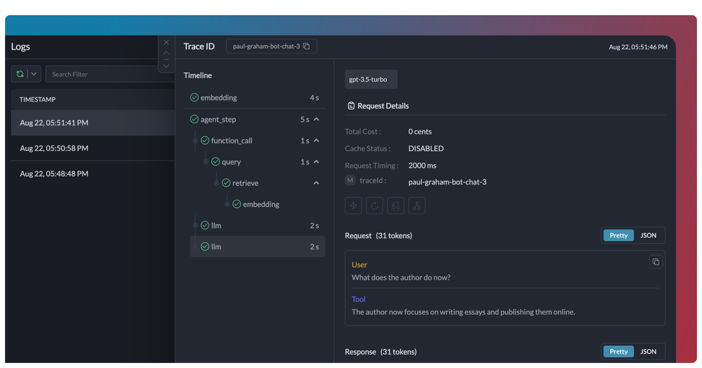

# Tracing


This feature is available for all plans:-

* [Developer](https://app.portkey.ai/): 10k Logs / Month with 3 day Log Retention
* [Production](https://app.portkey.ai/): 100k Logs / Month + $9 for additional 100k  with 30 Days Log Retention
* [Enterprise](https://portkey.ai/docs/product/enterprise-offering): Unlimited


The **Tracing** capabilities in Portkey empowers you to monitor the lifecycle of your LLM requests in a unified, chronological view.&#x20;

This is perfect for **agentic workflows**, **chatbots**, or **multi-step LLM calls**, by helping you understand and optimize your AI application's performance.

<figure><figcaption></figcaption></figure>

## How Tracing Works

Portkey implements OpenTelemetry-compliant tracing. When you include a `trace ID` with your requests, all related LLM calls are grouped together in the Traces View, appearing as "spans" within that trace.

> "Span" is another word for subgrouping of LLM calls. Based on how you instrument, it can refer to another group within your trace or to a single LLM call.

## Trace Tree Structure

Portkey uses a tree data structure for tracing, **similar to OTel.**&#x20;

Each node in the tree is a span with a unique `spanId` and optional `spanName`. Child spans link to a  parent via the `parentSpanId`. Parentless spans become root nodes.

```
traceId
├─ parentSpanId
│  ├─ spanId
│  ├─ spanName
```

| Key - Node   | Key - Python     | Expected Value | Required? |
| ------------ | ---------------- | -------------- | --------- |
| traceId      | trace\_id        | Unique string  | YES       |
| spanId       | span\_id         | Unique string  | NO        |
| spanName     | span\_name       | string         | NO        |
| parentSpanId | parent\_span\_id | Unique string  | NO        |

***

## Enabling Tracing

You can enable tracing by passing the `trace tree` values while making your request (or while instantiating your client).

Based on these values, Portkey will instrument your requests, and will show the exact trace with its spans on the "Traces" view in Logs page.



**Add tracing details to a single request (recommended)**

<pre class="language-javascript"><code class="lang-javascript">const requestOptions = {
<strong>    traceId: "1729",
</strong><strong>    spanId: "11",
</strong><strong>    spanName: "LLM Call"
</strong>}

const chatCompletion = await portkey.chat.completions.create({
    messages: [{ role: 'user', content: 'Say this is a test' }],
    model: 'gpt-4o',
}, requestOptions);
</code></pre>

#### Or, add trace details while instantiating your client

<pre class="language-typescript"><code class="lang-typescript">import Portkey from 'portkey-ai';

const portkey = new Portkey({
    apiKey: "PORTKEY_API_KEY",
    virtualKey: "VIRTUAL_KEY",
<strong>    traceId: "1729",
</strong><strong>    spanId: "11",
</strong><strong>    spanName: "LLM Call"
</strong>})
</code></pre>



```python
completion = portkey.with_options(
    trace_id="1729",
    span_id="11",
    span_name="LLM Call"        
).chat.completions.create(
    messages = [{ "role": 'user', "content": 'Say this is a test' }],
    model = 'gpt-3.5-turbo'
)
```

#### Pass Trace details while instantiating your client

<pre class="language-python"><code class="lang-python">from portkey_ai import Portkey

portkey = Portkey(
    api_key="PORTKEY_API_KEY",
    virtual_key="VIRTUAL_KEY",
<strong>    trace_id="1729",
</strong><strong>    span_id="11",
</strong><strong>    span_name="LLM Call"
</strong>)
</code></pre>



```javascript
import { createHeaders } from 'portkey-ai'

const requestOptions = {
    traceId: "1729",
    spanId: "11",
    spanName: "LLM Call"
}

const chatCompletion = await openai.chat.completions.create({
    messages: [{ role: 'user', content: 'Say this is a test' }],
    model: 'gpt-3.5-turbo',
}, requestOptions);
```



```python
from portkey_ai import createHeaders

req_headers = createHeaders(
    trace_id="1729",
    span_id="11",
    span_name="LLM Call
)

chat_complete = client.with_options(headers=req_headers).chat.completions.create(
    model="gpt-4",
    messages=[{"role": "user", "content": "Say this is a test"}],
)
```



```sh
curl https://api.portkey.ai/v1/chat/completions \
  -H "Content-Type: application/json" \
  -H "Authorization: Bearer $OPENAI_API_KEY" \
  -H "x-portkey-api-key: $PORTKEY_API_KEY" \
  -H "x-portkey-provider: openai" \
  -H "x-portkey-trace-id: 1729"\
  -H "x-portkey-span-id: 11"\
  -H "x-portkey-span-name: LLM_CALL"\
  -d '{
    "model": "gpt-4o",
    "messages": [{"role": "user","content": "Hello!"}]
  }'
```



#### If you are only passing trace ID and not the span details, you can set the trace ID while making your request or while instantiating your client.



```javascript
const requestOptions = {traceID: "YOUR_TRACE_ID"}

const chatCompletion = await portkey.chat.completions.create({
    messages: [{ role: 'user', content: 'Say this is a test' }],
    model: 'gpt-4o',
}, requestOptions);

console.log(chatCompletion.choices);
```

#### Pass Trace ID while instantiating your client

<pre class="language-javascript"><code class="lang-javascript">import Portkey from 'portkey-ai';

const portkey = new Portkey({
    apiKey: "PORTKEY_API_KEY",
    virtualKey: "VIRTUAL_KEY",
<strong>    traceID: "TRACE_ID"
</strong>})
</code></pre>



```python
completion = portkey.with_options(
    trace_id = "TRACE_ID"
).chat.completions.create(
    messages = [{ "role": 'user', "content": 'Say this is a test' }],
    model = 'gpt-3.5-turbo'
)
```

#### Pass Trace ID while instantiating your client

<pre class="language-python"><code class="lang-python">from portkey_ai import Portkey

portkey = Portkey(
    api_key="PORTKEY_API_KEY",
    virtual_key="VIRTUAL_KEY",
<strong>    trace_id="TRACE_ID"
</strong>)
</code></pre>



```javascript
import { createHeaders } from 'portkey-ai'

const reqHeaders = {headers: createHeaders({"traceID": "TRACE_ID"})}

const chatCompletion = await openai.chat.completions.create({
    messages: [{ role: 'user', content: 'Say this is a test' }],
    model: 'gpt-3.5-turbo',
}, reqHeaders);
```



```python
from portkey_ai import createHeaders

req_headers = createHeaders(trace_id="TRACE_ID")

chat_complete = client.with_options(headers=req_headers).chat.completions.create(
    model="gpt-4",
    messages=[{"role": "user", "content": "Say this is a test"}],
)
```



<pre class="language-bash"><code class="lang-bash">curl https://api.portkey.ai/v1/chat/completions \
  -H "Content-Type: application/json" \
  -H "Authorization: Bearer $OPENAI_API_KEY" \
  -H "x-portkey-api-key: $PORTKEY_API_KEY" \
  -H "x-portkey-provider: openai" \ 
<strong>  -H "x-portkey-trace-id: TRACE_ID" \
</strong>  -d '{
    "model": "gpt-4-turbo",
    "messages": [{
        "role": "system",
        "content": "You are a helpful assistant."
      },{
        "role": "user",
        "content": "Hello!"
      }]
  }'
</code></pre>



## See Tracing in Action



## Tracing in Langchain

Portkey has a dedicated handler that can instrument your Langchain chains and agents to trace them.



1. First, install Portkey SDK, and Langchain's packages

```bash
$ pip install langchain_OpenAI portkey-ai langchain_community
```

2. Import the packages

<pre class="language-python"><code class="lang-python">from langchain_openai import ChatOpenAI
from langchain.chains import LLMChain
<strong>from portkey_ai.langchain import LangchainCallbackHandler
</strong>from portkey_ai import createHeaders
</code></pre>

3. Instantiate Portkey's Langchain Callback Handler

<pre class="language-python"><code class="lang-python"><strong>portkey_handler = LangchainCallbackHandler(
</strong><strong>      api_key="YOUR_PORTKEY_API_KEY", 
</strong><strong>      metadata={
</strong><strong>            "user_name": "User_Name",
</strong><strong>            "traceId": "Langchain_sample_callback_handler"
</strong><strong>      }
</strong>)
</code></pre>

4. Add the callback to the `ChatOpenAI` instance

<pre class="language-python"><code class="lang-python">llm = ChatOpenAI(
    api_key="OPENAI_API_KEY",
<strong>    callbacks=[portkey_handler],
</strong>)
</code></pre>

5. Also add the callback when you define or run your LLM chain

<pre class="language-python"><code class="lang-python">chain = LLMChain(
    llm=llm,
    prompt=prompt,
<strong>    callbacks=[portkey_handler]
</strong>)

<strong>handler_config = {'callbacks' : [portkey_handler]}
</strong>
<strong>chain.invoke({"input": "what is langchain?"}, config=handler_config)
</strong></code></pre>



***

## Tracing Llamaindex Requests

Portkey has a dedicated handler to instrument your Llamaindex requests on Portkey.



1. First, install Portkey SDK, and LlamaIndex packages

```bash
$ pip install openai portkey-ai llama-index 
```

2. Import the packages

<pre class="language-python"><code class="lang-python">from llama_index.llms.openai import OpenAI
<strong>from portkey_ai.llamaindex import LlamaIndexCallbackHandler
</strong></code></pre>

3. Instantiate Portkey's LlamaIndex Callback Handler

```python
portkey_handler = LlamaIndexCallbackHandler(
      api_key="PORTKEY_API_KEY",
      metadata={
            "user_name": "User_Name",
            "traceId": "Llamaindex_sample_callback_handler"
      }
)
```

4. Add it to `OpenAI` llm class

```python
llm = OpenAI(
    model="gpt-4o",
    api_key="OPENAI_API_KEY",
    callback_manager=[portkey_handler],
)
```

5. In Llama Index, you can also set the callback at a global level

<pre class="language-python"><code class="lang-python">from llama_index.core import Settings
from llama_index.core.callbacks import CallbackManager

<strong>Settings.callback_manager = CallbackManager([portkey_handler])
</strong>Settings.llm = llm
</code></pre>



***

## Inserting Logs

If you are using the [Insert Log API](../../portkey-endpoints/logs/insert-a-log.md) to add logs to Portkey, your `traceId`, `spanId` etc. will become part of the metadata object in your log, and Portkey will instrument your requests to take those values into account.

The logger endpoint supports inserting a single log as well as log array, and helps you build traces of any depth or complexity. For more, check here:


[insert-a-log.md](../../portkey-endpoints/logs/insert-a-log.md)


***

## Tracing for Gateway Features

Tracing also works very well to capture the Gateway behavior on retries, fallbacks, and other routing mechanisms on Portkey Gateway.&#x20;

Portkey automatically groups all the requests that were part of a single fallback or retry config and shows the failed and succeeded requests chronologically as "spans" inside a "trace".

This is especially useful when you want to understand the total latency and behavior of your app when retry or fallbacks were triggered.

For more, check out the [Fallback](../ai-gateway/fallbacks.md) & [Automatic Retries](../ai-gateway/automatic-retries.md) docs.

***

## Why Use Tracing?

* **Cost Insights**: View aggregate LLM costs at the trace level.
* **Debugging**: Easily browse all requests in a single trace and identify failures.
* **Performance Analysis**: Understand your entire request lifecycle and total trace duration.
* **User Feedback Integration**: Link user feedback to specific traces for targeted improvements.

***

## Capturing User Feedback

Trace IDs can also be used to link user feedback to specific generations. This can be used in a system where users provide feedback, like a thumbs up or thumbs down, or something more complex via our feedback APIs. This feedback can be linked to traces which can span over a single generation or multiple ones. Read more here:


[feedback.md](feedback.md)

